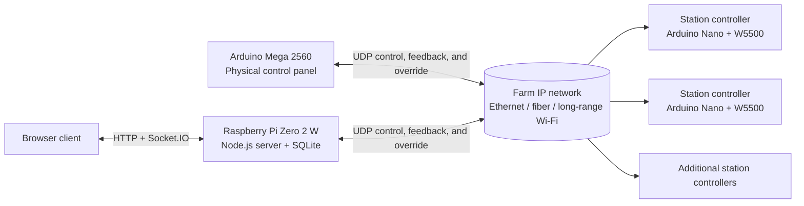

# Cabane Control

Cabane Control is a custom control system for a maple syrup pumping station. It replaces an analog control setup with a physical Arduino control panel, interchangeable networked station controllers, and an optional Raspberry Pi web interface for monitoring and remote operation.

The project was built for a real family maple farm where physical switches matter as much as remote access. The design keeps the tactile, old-school control panel while adding wireless connectivity, live status, alarms, automation, simulation, weather data, and user messaging.

> **Project status:** This is an evolving custom prototype intended for farm deployment. It has been exercised in normal operation and during abrupt network disconnection/reconnection, but it is not a certified industrial safety system. Verify the electrical design, interlocks, watchdog behavior, and failure modes with qualified personnel before connecting live equipment.

## Why this system exists

Commercial solutions considered for the farm were primarily touchscreen-based. Cabane Control was designed around physical switches and indicator lights so the operator can control the system without relying on a screen.

The system also needed to span properties roughly 1 km apart. The station controllers therefore communicate over an IP network, allowing the remote stations to use a long-range Wi-Fi link while nearby stations can use the farm's wired or fiber network.

The original control requirements grew beyond simple relay switching and include:

- temperature-controlled vacuum operation;
- vacuum-loss and station-disconnection indication;
- a burglar-alarm input routed through the control system;
- remote control with an explicit authority handoff;
- a Raspberry Pi server that can continue operation if the physical controller is unavailable; and
- a demonstration/test box with physical switches and lights for exercising the station behavior.

## System overview



The main controller and the Raspberry Pi are designed as two possible masters, but only one should command the stations at a time:

1. The physical main controller, shown in the application as **CABANE**, is the normal master.
2. An authorized user can hand control to the server through the web application.
3. While the server is in control, the application works with virtual switch states and the main controller reports its physical switch positions as a reference.
4. The main controller can reclaim control with the configured physical emergency action, or when it returns after being offline.
5. Heartbeats, link supervision, and command watchdogs expose disconnected stations and help the system recover from controller failures.

## Hardware and communications

### Main controller

The main controller firmware is written for an Arduino Mega 2560 and currently uses:

- a W5500 Ethernet interface;
- an MCP23017 I/O expander for additional physical inputs;
- physical switches for pumps, valves, thermostats, and the buzzer;
- paired red/green LED indicators;
- a buzzer output;
- EEPROM-backed station enable settings; and
- thermostat, vacuum alarm, burglar alarm, inversion-mask, and override logic.

The current source identifies the firmware as `v5.6-FullProduction` in [`Code/Main/Main_Controller/Main_Controller.ino`](<Code/Main/Main_Controller/Main_Controller.ino>).

### Station controllers

Each station controller is based on an Arduino Nano with a W5500 Ethernet interface. The current firmware provides:

- six relay outputs;
- digital and analog feedback inputs;
- an optional TM1637 station display;
- a pushbutton for selecting and storing a station ID in EEPROM;
- heartbeat and feedback broadcasts;
- duplicate station-ID detection;
- Ethernet-link and command-watchdog status; and
- relay control from checksummed UDP command frames.

The current source identifies the firmware as `v5.7-VegasFix` in [`Code/Stations/Station_Controller/Station_Controller.ino`](<Code/Stations/Station_Controller/Station_Controller.ino>).

### Network defaults in the current source

These values are hard-coded defaults in the current implementation and should be reviewed before connecting the system to another network.

| Setting | Current value |
| --- | --- |
| Main controller address | `192.168.1.220` |
| Station address pattern | `192.168.1.210 + station ID` |
| Broadcast address | `192.168.1.255` |
| Command/configuration UDP port | `8888` |
| Feedback/heartbeat UDP port | `8889` |
| Packet integrity | XOR checksums |

The long-range Wi-Fi link is a network transport between sites; it is not a separate application protocol. The controllers use the same UDP protocol regardless of whether the network path is local Ethernet, fiber, or Wi-Fi.

### Station-count and mapping note

The farm deployment described for this project has five station locations: three connected through the local wired/fiber infrastructure and two reached by long-range Wi-Fi. The current firmware and server state model retain six logical station IDs (`0`–`5`), while the current implementation maps the former Station 5 controls and feedback into Station 4 hardware. Confirm the final physical wiring and station numbering against the source and the wiring documents before installation.

## Software components

### Raspberry Pi server

The backend in [`Code/Server/cabane-control`](<Code/Server/cabane-control>) is a Node.js service that combines:

- Express HTTP routes;
- Socket.IO real-time state updates;
- SQLite persistence;
- a UDP bridge to the controllers;
- the dual-master control and failsafe logic;
- authentication, registration, email verification, and administrator approval;
- user permissions and settings;
- activity and alarm logging;
- weather-service integration;
- drainage automation and timed shutdown logic; and
- an isolated station simulator.

The server is intended to run on a Raspberry Pi Zero 2 W with Ethernet. Raspberry Pi provisioning, PM2 startup, hardware watchdog, and Cloudflare Tunnel notes are in the [server documentation](<Code/Server/Instructions.md>), [PM2 setup guide](<docs/Server/PM2_SETUP.md>), [watchdog guide](<docs/Server/WATCHDOG_SETUP.md>), and [Cloudflare Tunnel guide](<docs/Cloudflare Tunnel Setup Guide.md>).

### Web application

The frontend in [`Code/Server/frontend/cabane-ui`](<Code/Server/frontend/cabane-ui>) is a React/Vite application with a responsive control-panel layout. The source includes:

- login, registration, email-verification, and session handling;
- responsive station cards and industrial-style rocker controls;
- momentary halo buttons and toggle controls;
- live controller, station, feedback, and alarm status;
- control handoff and release actions;
- weather and clock widgets;
- English and French localization;
- audio and vibration notifications;
- user settings and automatic locking;
- administration and activity-log views;
- direct messages, groups, notes, sharing, and urgent flash messages;
- drainage automation and shutdown controls; and
- an isolated simulator for testing behavior without operating the physical system.

The browser application is responsive, but native iOS/Android wrappers and biometric authentication are not present in this repository snapshot. They remain future work in [`Code/Server/TODO.md`](<Code/Server/TODO.md>).

## Repository layout

```text
.
├── Code/
│   ├── Main/
│   │   └── Main_Controller/       Arduino Mega firmware
│   ├── Stations/
│   │   └── Station_Controller/   Arduino Nano station firmware
│   ├── Server/
│   │   ├── cabane-control/        Node.js backend, UDP bridge, SQLite setup
│   │   ├── frontend/cabane-ui/    React/Vite web application
│   │   └── tests/                 Backend/integration test scripts
│   ├── Utilities/                 Arduino pin and hardware test sketches
│   └── tests/                     Manual system test procedures
├── docs/
│   ├── Main/                      Main-controller wiring and design files
│   ├── Server/                    Raspberry Pi deployment guides
│   ├── Stations/                  Station wiring and design files
│   └── Webapp/                    Product and web-application notes
└── Server Clones/                 Local server clones; ignored by Git
```

## Development and deployment notes

### Frontend development

The frontend has its own package manifest and scripts:

```bash
cd Code/Server/frontend/cabane-ui
npm ci
npm run dev
```

Development mode uses `http://localhost:3000` as the default API/server address. Set `VITE_API_URL` when the backend is running somewhere else:

```bash
VITE_API_URL=http://localhost:3000 npm run dev
```

The available frontend scripts are:

```bash
npm run dev
npm run build
npm run lint
npm test
```

### Backend deployment

The backend expects a built frontend under `Code/Server/cabane-control/public/` because [`server.js`](<Code/Server/cabane-control/server.js>) serves that directory. The current working tree contains frontend build output under `Code/Server/frontend/cabane-ui/dist/`, but that output is ignored and the backend `public/` directory is absent. A deployment process must copy or otherwise publish the frontend build into the directory expected by Express.

The server uses environment variables for its port, JWT signing secret, public URL, email transport, administrator email, and weather configuration. Keep deployment values outside version control.

The database initializer is [`setup_db.js`](<Code/Server/cabane-control/setup_db.js>). It creates the user, settings, logs, messaging, notes, and simulator-related schema used by the application. The initializer also creates an administrator account for first-time setup; change that account's password immediately and do not expose the server with default credentials.

### Arduino development

Open the relevant `.ino` file in Arduino IDE and select the matching board:

- `Main_Controller.ino`: Arduino Mega 2560;
- `Station_Controller.ino`: Arduino Nano.

The firmware uses Arduino Ethernet/W5500 networking. The main controller also uses the Adafruit MCP23X17 library; the station controller optionally uses TM1637Display. Pin assignments, connector wiring, power notes, and operator behavior are documented in the hardware manuals.

## Testing and validation

The repository includes manual procedures for:

- main-controller loss and server headless recovery;
- controller reconnection and authority reclaim;
- station heartbeat and feedback behavior;
- urgent messaging and acknowledgement; and
- relay, LED, input, and wiring checks using the utility sketches and simulator.

Start with [`Code/tests/TESTING_PROCEDURES.md`](<Code/tests/TESTING_PROCEDURES.md>) and the [main-controller verification report](<docs/Main/Main_Controller_Verification_Report.md>). The backend messaging script in [`Code/Server/tests/test_messaging.js`](<Code/Server/tests/test_messaging.js>) expects a running server and test configuration.

Because this system operates pumps, valves, vacuum equipment, and alarms, test disconnected and failed states deliberately on a non-production test box before testing live equipment.

## Documentation index

- [Wiring and hardware manual](<docs/Part 1- Wiring & Hardware Manual.md>)
- [Main controller guide](<docs/Main/Main_Controller_Guide.md>)
- [Main controller verification report](<docs/Main/Main_Controller_Verification_Report.md>)
- [Station controller guide](<docs/Stations/Station_Controller_Guide.md>)
- [Station connector pins](<docs/Stations/Connector Pins.md>)
- [Main-controller pin map](<docs/Arduino_MainController_PinMap_Stations1-5.md>)
- [Server product requirements](<Code/Server/PRD.md>)
- [Development roadmap](<Code/Server/TODO.md>)
- [Cloudflare Tunnel setup](<docs/Cloudflare Tunnel Setup Guide.md>)
- [PM2 auto-start setup](<docs/Server/PM2_SETUP.md>)
- [Raspberry Pi watchdog setup](<docs/Server/WATCHDOG_SETUP.md>)
- [Automation sequence notes](<docs/Automation.txt>)

The `docs/` tree also contains enclosure drawings, panel artwork, connector photographs, pinout diagrams, PDFs, and other design assets.

## Publication checklist

This repository is not ready to make public without a security and history review. In the current Git index, the following local or sensitive-looking artifacts are tracked:

- `Code/Server/cabane-control/.env`;
- `Code/Server/tests/test.env`;
- `Code/Server/cabane-control/cabane.db`; and
- `Code/Server/Pi Backups/pi-backup-2025-12-12.tar.gz` (approximately 934 MB).

Before publishing to GitHub:

1. Confirm that no live passwords, JWT secrets, email credentials, personal data, user records, or private network information are present in those files.
2. Rotate any credential that has ever been stored in a committed file.
3. Remove sensitive and generated artifacts from the repository history, not only from the working tree.
4. Add appropriate ignore rules for environment files, SQLite databases, Raspberry Pi backups, build output, and local dependencies.
5. Reconcile the backend package manifest with the modules imported by the server so a fresh clone can be installed reproducibly.
6. Reconcile older wiring guides and pin maps with the current `v5.6`/`v5.7` firmware before publishing a “production” wiring reference.
7. Add a license if this project is intended for reuse; no root license file is currently included.

This README intentionally does not remove or alter any of those files.

## License

No license has been selected yet. Until a license is added, all rights remain with the copyright holder.
